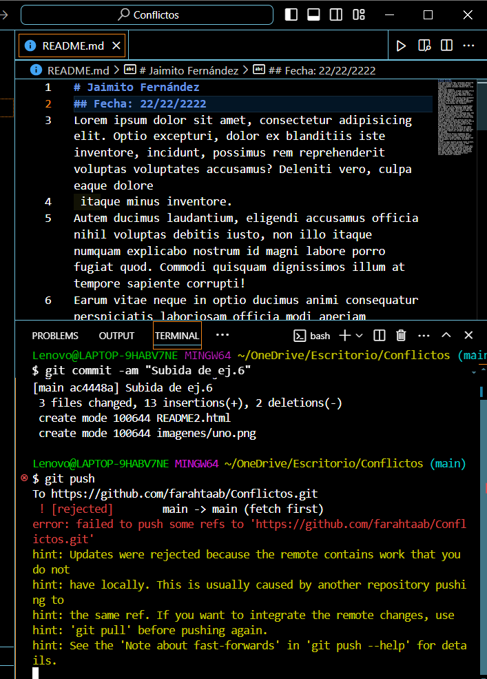
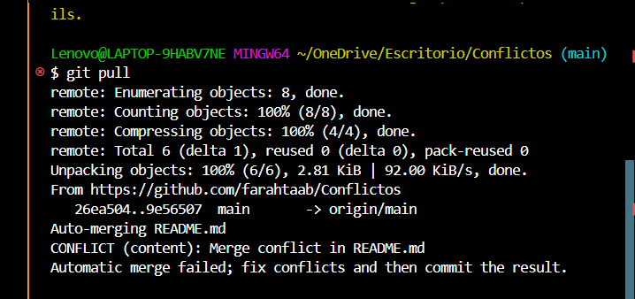
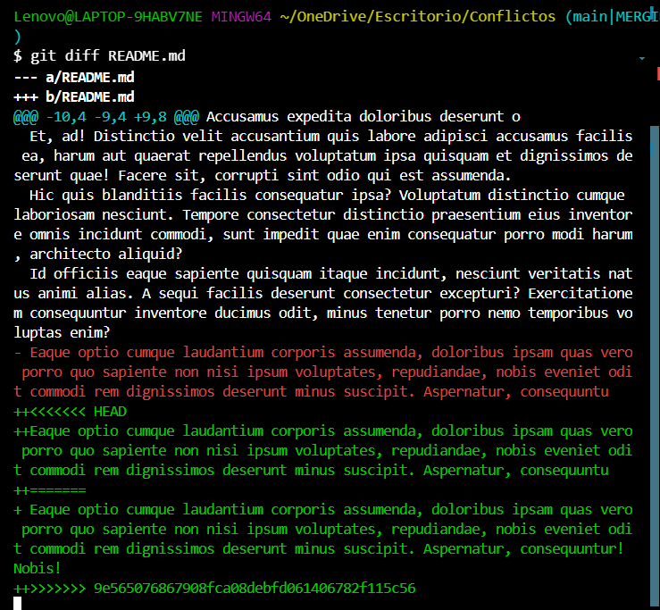
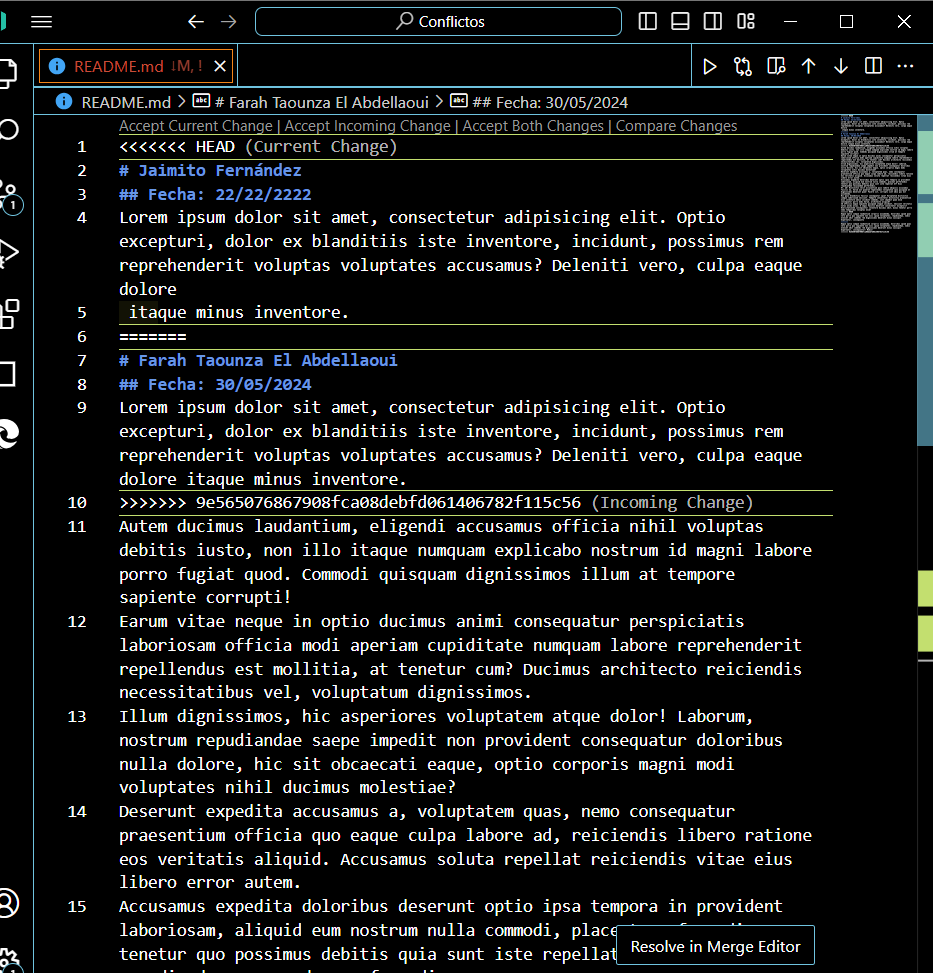

## EJERCICIOS DE RESOLUCIÓN DE CONFLICTOS

### 1. 
### 1.1_ Creamos un repo remoto y le añadimos un README.md con el contenido proporcionado. 
### 1.2_ En nuestro host clonamos el repo proporcionado con `git clone url`

    - En el remoto modificamos el nombre y la fecha por nuestro nombre y la fecha actual.
    - En el local ponemos nombre: Jaimito Fernández y de fecha 22/22/2222. (NO HACEMOS NINGÚN PULL!!)
  
### 2. Intentamos hacer un push desde el remoto:
   

### 3. Intentamos hacer un pull (hay un conflicto!!!):

    - Git no puede resolver esto por lo tanto nos deja la responsabilidad a nosotros como programadores de escoger la version con la que nos queremos quedar.
   

### 4. Existe la posibilidad de ver los combios con git diff de la manera siguiente:

